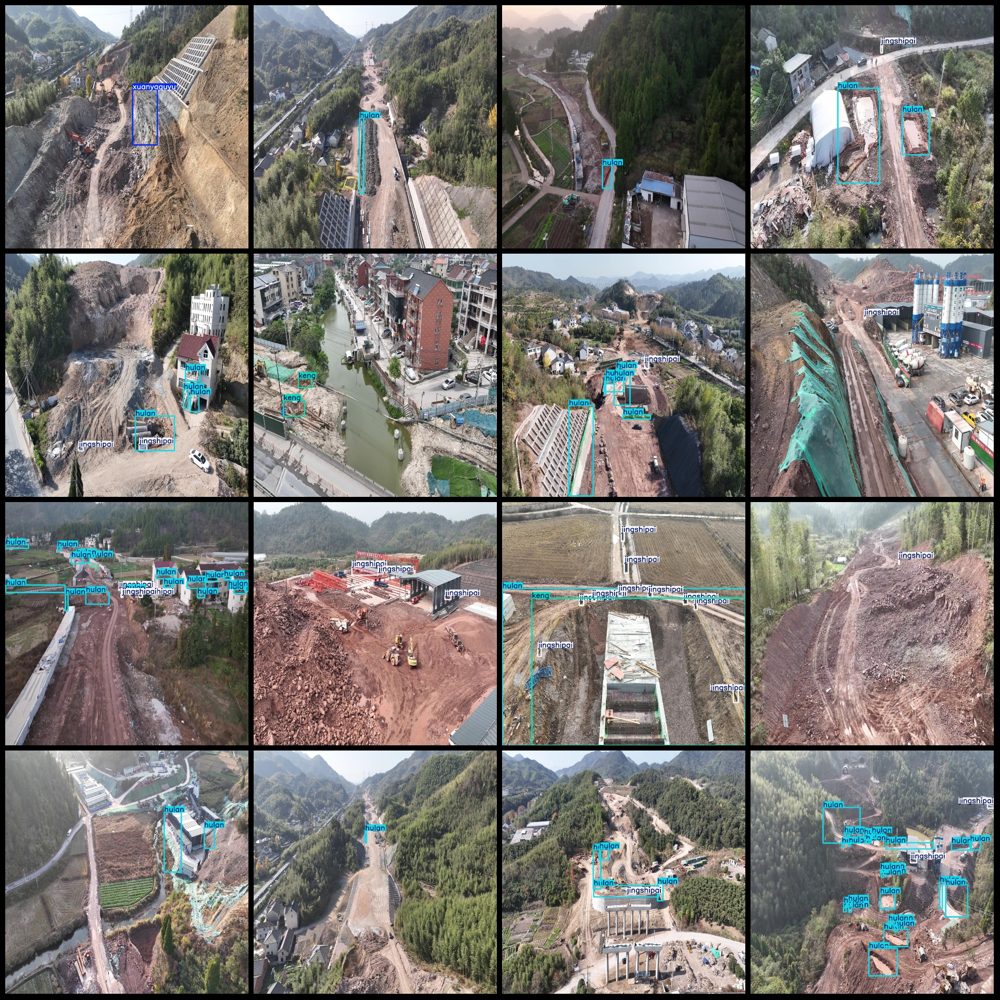
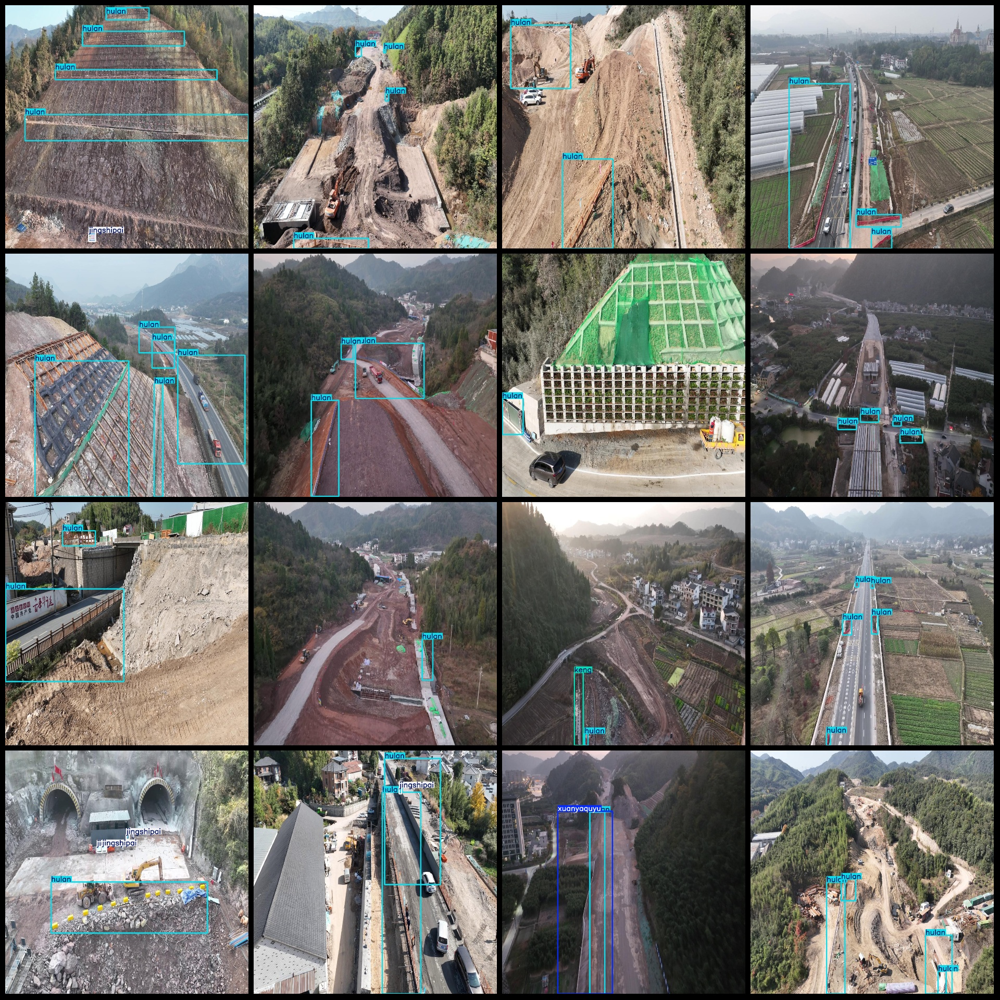

# Drone Perspective Aerial Photography Smart Construction Site Inspection Fence Hole Warning Sign Safety Facilities Monitoring Data Set - VOC+YOLO Format, 6051 Categories

Dataset format: Pascal VOC format + YOLO format (txt file without split path, only containing jpg images and corresponding VOC format xml files and YOLO format txt files)
Number of images (jpg file count): 6051
Number of annotations (xml file count): 6051
Number of annotations (txt file count): 6051
Number of category classes: 5
Category class names in the annotation files (note that the order of categories in the YOLO format does not correspond to this, but is based on the labels folder's classes.txt): ["hulan", 
"jingshipai", "keng", "shuiyu", "xuanyaquyu"]
Corresponding Chinese category names: ["Fence", "Warning Sign", "Pit", "Water Area", "Cliff Area"]
Boxes per category:
hulan boxes = 20251
jingshipai boxes = 6505
keng boxes = 1670
shuiyu boxes = 48
xuanyaquyu boxes = 298
Total boxes: 28772
Number of images per category:
hulan images = 5222
jingshipai images = 1935
keng images = 850
shuiyu images = 31
xuanyaquyu images = 252
Image resolution: 1024x1024
Annotation tool used: labelImg
Annotation rules: Draw a box around the category
Important Notice: The dataset does not have been divided into training, validation, or test sets, and must be partitioned by the user.
Special Remark: This dataset does not guarantee any accuracy improvement to the trained models or weight files.
Image preview:

## Images

Here is a pay link on Stripe ( https://buy.stripe.com/3cs8yP7sY87d0vu9AB ). Please contact me lonlonago@foxmail.com after funding $89, and I will send you a complete data files , thank you!

